## <center>vscode_cmake_msvc项目配置与初步

### 1. 概述

​       日常开发中，如果在Windows平台下，大部分用户会使用visual studio 20XX IDE完成整个项目的开发、编译、调试。微软的这个集成开发环境是非常全面的，将我们整个开发周期都完全管理了。有过Linux开发的用户非常清楚，通常的做法是在Vim编辑器写程序，这一步仅仅是将代码文件编辑好了，但是具体的编译还有调试过程非常复杂，涉及了一些列配置，例如编译链接的源文件、头文件、第三方库等，以及指定用什么编译器等等。例如编译g++ main.cpp -o main -lpthread等。

​		多文件多目录组织结构的项目，如果按照g++ main.cpp -o main -lpthread这种形式就非常麻烦，为了规范化与简化工作，有一种叫做makefile的规则应运而生，说白了其实就是指定所有链接的依赖关系，类似于预定好编译脚本。而编写makefile也不是一件容易的事情，为了再次简化这个工作cmake这个工具提到了非常大的作用，通常我们使用比较简单的一些配置，就可以生成makefile,从而为编译项目带来了便利。

​		我们脱离完全的IDE创建一些应用程序，从最基本来学习cmake管理项目以及编译项目的方法。本系列使用的vscode_cmake_msvc这三个工具来完成任务。

在 Visual Studio Code (VSCode) 中使用 CMake 和 MSVC 编译器的组合有许多优点，尤其是在处理跨平台的 C++ 项目时。以下是这种组合的一些主要优点：

**（1）跨平台支持**

- **CMake** 是一个跨平台的构建系统生成器，可以生成适用于不同平台（如 Windows、Linux 和 macOS）的构建文件。使用 CMake，可以确保你的构建脚本在不同平台上工作一致。
- **VSCode** 也是一个跨平台的开发环境，适用于多种操作系统。

**（2）强大的编译器**

- **MSVC**（Microsoft Visual C++）是 Windows 上非常强大的编译器，具有出色的优化和调试支持，特别适合开发 `Windows` 应用程序。

**（3）现代开发工具**

- **VSCode** 提供了丰富的插件和扩展，如 CMake Tools 和 C++ 插件，可以极大地增强开发体验。
- **CMake Tools** 插件使得 CMake 在 VSCode 中的使用更加便捷，提供了直观的用户界面和命令，可以轻松进行配置和构建。

 **（4）集成调试**

- 使用 **MSVC** 编译器，VSCode 提供了强大的调试支持。你可以在 VSCode 中设置断点、查看变量、调用堆栈等，享受类似于 Visual Studio 的调试体验。
- 通过 **CMake Tools** 插件，VSCode 可以自动检测和配置调试器，使调试过程更加流畅。

 **（5）灵活的配置管理**

- CMake 允许你轻松地管理不同的构建配置（如 Debug 和 Release），以及生成不同的平台和编译器的构建文件。
- 你可以在 VSCode 中通过 `settings.json` 和 `c_cpp_properties.json` 轻松切换编译器和调试配置。

 **（6）高效的构建系统**

- CMake 支持增量构建和并行构建，可以极大地提高构建效率。
- CMake 能够与多种生成器（如 Ninja）配合使用，进一步优化构建性能。

 **（7）易于扩展和维护**

- 使用 CMake 可以更容易地管理依赖项、第三方库和模块，特别是对于大型项目。

- VSCode 的插件系统和配置文件使得项目的配置和维护变得更加简单和灵活。

- 

  说明：默认已经安装了vscode/cmake/msvc

  我们可以在 Visual Studio Code (VSCode) 中配置 CMake 来编译一个 C++ 项目，而不使用 Visual Studio 2022，毕竟一个单文件的project对于visual studio也需要创建一个工程。下面是详细的步骤，包括项目结构、CMake 配置和在 VSCode 中的设置。

### 2. 项目结构

首先，我们定义项目结构：

```
Project/
├── CMakeLists.txt
├── src/
│   ├── main.cpp
│   └── MyLibrary.cpp
└── include/
    └── MyLibrary.h
```

在cmd命令行运行”code“，打开vscode，选择一个项目的根目录:

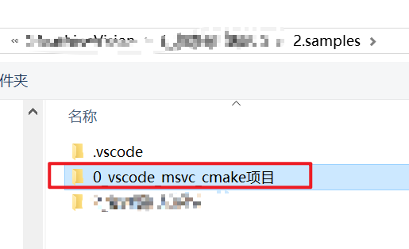

依次创建项目结构中的目录：


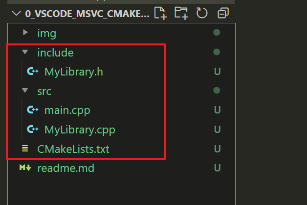

### 3. 详细配置

#### 3.1 CMakeLists.txt

​		在 `Project` 目录下创建 `CMakeLists.txt` (注意名称区分大小写)文件，内容如下：

```CMake
cmake_minimum_required(VERSION 3.10)
# 项目名称
project(Project)
# 设置 C++ 标准 stdc++ 17
set(CMAKE_CXX_STANDARD 17)
set(CMAKE_CXX_STANDARD_REQUIRED True)
# 包含目录
include_directories(include)
# 添加源文件
#file(GLOB SOURCES "src/*.cpp")
# 手动列出所有源文件
set(SOURCES
    src/main.cpp
    src/MyLibrary.cpp
)
# 添加可执行文件
add_executable(Project ${SOURCES})
```

#### 3.2 头文件

在 `include` 目录下创建 `MyLibrary.h` 文件，内容如下：

```cpp
#ifndef MYLIBRARY_H
#define MYLIBRARY_H

void MyLibraryFunction();

#endif // MYLIBRARY_H
```

#### 3.3 源文件

在 `src` 目录下创建 `MyLibrary.cpp` 文件，内容如下：

```cpp
#include "MyLibrary.h"
#include <iostream>

void MyLibraryFunction() {
    std::cout << "MyLibraryFunction called!" << std::endl;
}
```

在 `src` 目录下创建 `main.cpp` 文件，内容如下：

```cpp
#include "MyLibrary.h"
#include <iostream>

int main()
{
  std::cout << "Hello, World!" << std::endl;
  MyLibraryFunction();
  std::cout << "按任意键退出" << std::endl;
  getchar();
  return 0;
}
```

#### 3.4 配置MSVC

**（1）安装必要的扩展**：

在 VSCode 中安装以下扩展：

- C/C++ by Microsoft

  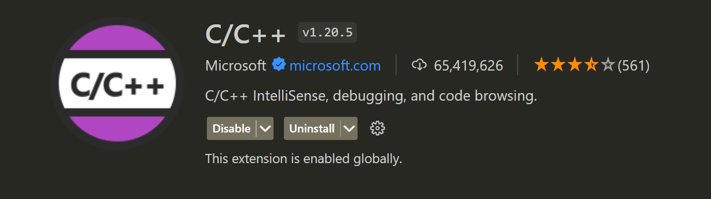

- CMake by Microsoft

- CMake Tools by Microsoft

  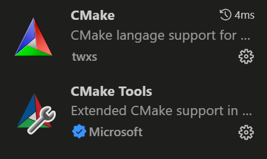

**（2）配置 CMake Tools**：

在项目根目录下创建一个文件夹 `.vscode`，并在其中创建一个 `settings.json` 文件，内容如下：

```json
{
  "cmake.generator": "Visual Studio 17 2022",
  "cmake.sourceDirectory": "${workspaceFolder}",
  "cmake.buildDirectory": "${workspaceFolder}/output/build",   //cmake生成中间文件
  "cmake.configureSettings": {
    "CMAKE_RUNTIME_OUTPUT_DIRECTORY": "${workspaceFolder}/output/exe",  //可执行程序目录
    "CMAKE_ARCHIVE_OUTPUT_DIRECTORY": "${workspaceFolder}/output/lib",  //库目录
    "CMAKE_LIBRARY_OUTPUT_DIRECTORY": "${workspaceFolder}/output/lib"
  }
}
```

这里我们选择了 Visual Studio 2022 作为生成器，你也可以选择其他版本，例如”Ninja“，但是要注意我们这里使用的是MSVC，所以还是要与之匹配。

上面的配置就是设置了工作目录，以及最终CMake编译生成的内容存放目录：

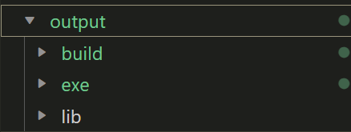

**(3) 配置编译器：**

在 .vscode 文件夹中创建一个名为 c_cpp_properties.json 的文件，配置如下：

```json
{
  "configurations": [
    {
      "name": "Win32",
      "includePath": [
        "${workspaceFolder}/**",
        "${workspaceFolder}/include"
      ],
      "defines": [
        "_DEBUG",
        "UNICODE",
        "_UNICODE"
      ],
      "windowsSdkVersion": "10.0.19041.0",
      "compilerPath": "E:\\Program\\VS2022\\IDE\\VC\\Tools\\MSVC\\14.38.33130\\bin\\Hostx64\\x64\\cl.exe",
      "cStandard": "c11",
      "cppStandard": "c++17",
      "intelliSenseMode": "msvc-x64"
    }
  ],
  "version": 4
}
```

请根据你的实际安装路径修改 `compilerPath`。

**（4）生成和构建**：

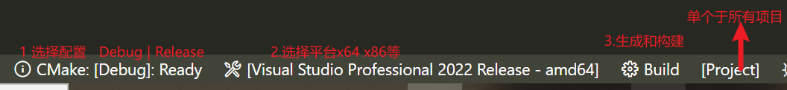

- 打开命令面板 (Ctrl+Shift+P)，然后运行 `CMake: Configure` 命令，选择你需要的配置（如 Debug 或 Release）。

  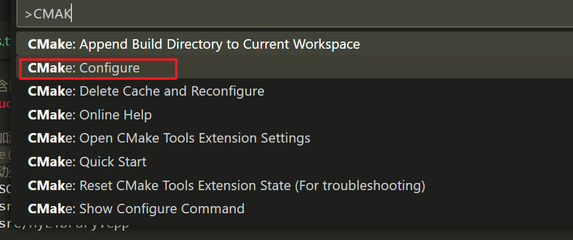

  

- 运行 `CMake: Build` 命令来编译项目

可以点击上面给出的底部工具栏，完成项目生成。

#### 3.5 生成应用

点击`build`之后会在output/exe/Debug生成应用程序：

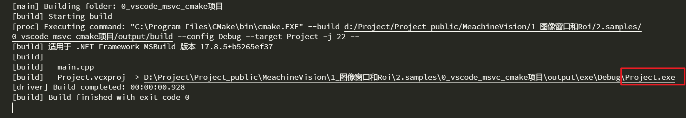

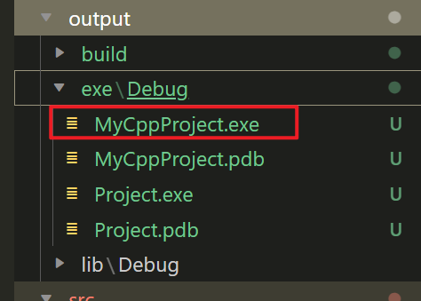

运行这个应用程序：

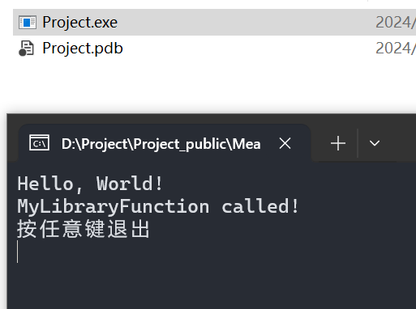

#### 3.6 运行和调试

有一个特别说明的是系统文件找不到的问题（如果启用调试），例如`iostream`：


这个问题是因为我们打开的vscode终端没有设置环境变量，导致找不到msvc编译器相关的内容，最简单的就是我们从msvc编译器的终端打开vscode这样环境就会自动初始化（这个于Ananconda类似）：


首先这个终端会自动初始化环境：


终端输入"code",即可打开vscode，此时系统文件可以找到:


如果需要使用vscode运行和调试应用，那么必须添加`tasks.json`文件，我们可以点击`运行和调试`来快速生成默认的配置(必须要选中某个有效的cpp文件，例如main.cpp)：

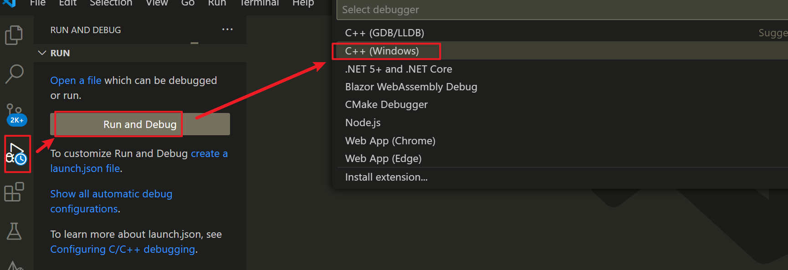

首先生成`tasks.json`:

```json
{
  "tasks": [
    {
      "type": "cppbuild",
      "label": "C/C++: cl.exe build active file",
      "command": "cl.exe",
      "args": [
        "/Zi",
        "/EHsc",
        "/nologo",
        "/Fo${workspaceFolder}/output/build/",   //中间文件生成目录
        "/Fe${workspaceFolder}/output/exe/Debug/Project.exe", //exe生成目录
        "${file}",
        "./src/MyLibrary.cpp",
        "./src/main.cpp",
        "-I",
        "include",
      ],
      "options": {
        "cwd": "${workspaceFolder}"
      },
      "problemMatcher": [
        "$msCompile"
      ],
      "group": {
        "kind": "build",
        "isDefault": true
      },
      "detail": "Task generated by Debugger."
    }
  ],
  "version": "2.0.0"
}
```

这里需要对默认生成的进行一个修改：


所有配置完成之后就可以在行号前面打上断点进行调试：


以后就可以快速调试了，也可以把这些配置作为一个模板：


### 4. linux平台配置

如果我们开发的项目是linux平台的，真正要实现跨平台，那么必须要安装g++/gcc编译器，因为msvc是专用于微软的编译器。windows下可以通过MinGW安装g++/gcc。具体的过程这里不讲了，我们主要的目的是用cmake管理很多第三方库，现在给出一些配置的参考。

下面这是一个关于相机封装于project，其结构如下:

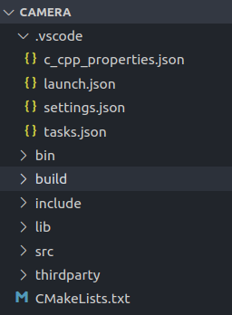

#### 4.1 c_cpp_properties.json

```json
{
    "configurations": [
        {
            "name": "Linux",
            "includePath": [
                "${workspaceFolder}/**",
                "${workspaceFolder}/thirdparty/include/opencv480/**"
                //"${workspaceFolder}/thirdparty/include/opencv480/opencv2/**",
            ],
            "defines": [],
            "compilerPath": "/usr/bin/gcc",
            "cStandard": "c11",
            "cppStandard": "c++11",
            "intelliSenseMode": "linux-gcc-x64"
        }
    ],
    "version": 4
}
```

可以看到配置了opencv4.8.0版本的库，使用的编译器是gcc/g++

#### 4.2 launch.json

```json
{
    "configurations": [
        {
            "name": "C/C++: gcc 生成和调试活动文件",
            "type": "cppdbg",
            "request": "launch",
            "program": "${workspaceFolder}/bin/camera_test",
            "args": [],
            "stopAtEntry": false,
            "cwd": "${workspaceFolder}",
            "environment": [],
            "externalConsole": true,
            "MIMode": "gdb",
            "setupCommands": [
                {
                    "description": "为 gdb 启用整齐打印",
                    "text": "-enable-pretty-printing",
                    "ignoreFailures": true
                },
                {
                    "description": "将反汇编风格设置为 Intel",
                    "text": "-gdb-set disassembly-flavor intel",
                    "ignoreFailures": true
                }
            ],
            "preLaunchTask": "C/C++: gcc 生成活动文件",
            "miDebuggerPath": "/usr/bin/gdb"
        }
    ],
    "version": "2.0.0"
}
```

#### 4.3 tasks.json

```json
{
    "tasks": [
        {
            "type": "cppbuild",
            "label": "C/C++: gcc 生成活动文件",
            "command": "/usr/bin/gcc",
            "args": [
                "-fdiagnostics-color=always",
                "-g",
                "${file}",
                "./src/Camera.cpp",
                "./src/ColPaGene.cpp",
                "-o",
                "bin/camera_test",
                "-I", "include",
                "-I", "thirdparty/include/opencv480",
                "-I", "thirdparty/include/opencv480/opencv2",
                "-I", "thirdparty/include/P_XYZ",
                "-L", "/usr/lib/thirdparty",
                "-l", "av_filterlib",
                "-l", "stdc++",
                //"-L", "lib",
                "-l", "opencv_core",
                "-l", "opencv_calib3d",
                "-l", "opencv_imgproc",
                "-l", "opencv_highgui",
                "-l", "opencv_videoio",
                "-l", "opencv_aruco",
                "-l", "opencv_objdetect",
                //"-l", "Camera",
            ],
            "options": {
                "cwd": "${workspaceFolder}"
            },
            "problemMatcher": [
                "$gcc"
            ],
            "group": {
                "kind": "build",
                "isDefault": true
            },
            "detail": "调试器生成的任务。"
        }
    ],
    "version": "2.0.0"
}
```

在这里具体链接了各种库文件有了tasks.json可以很方便的在vscode中调试

#### 4.4 CMakeLists.txt

```cmake
cmake_minimum_required(VERSION 3.12.0)
project(camera)

set(CMAKE_INCLUDE_CURRENT_DIR ON)
# 设置可执行文件目录
set(CMAKE_RUNTIME_OUTPUT_DIRECTORY ${CMAKE_SOURCE_DIR}/bin)

set(CMAKE_AUTOMOC ON)
set(CMAKE_CXX_STANDARD 11)

include_directories(include)
include_directories(thirdparty/include/opencv480 thirdparty/include/P_XYZ)
link_directories(/usr/lib/thirdparty)

# 将 xxx.cpp 编译成动态库
add_library(Camera SHARED src/ColPaGene.cpp src/Camera.cpp)
target_link_libraries(Camera libav_filterlib.so.3.0.1.01)
# 可选：指定动态库输出目录（默认会放在 build 目录下）
set_target_properties(Camera PROPERTIES LIBRARY_OUTPUT_DIRECTORY ${CMAKE_SOURCE_DIR}/lib)

# 添加可执行文件
# add_executable(camera_calibration src/camera_calibration.cpp src/ColPaGene.cpp src/Camera.cpp)
add_executable(camera_test src/main.cpp src/ColPaGene.cpp src/Camera.cpp)

# 链接库文件
target_link_libraries(camera_test libav_filterlib.so.3.0.1.01)
target_link_libraries(camera_test  opencv_core.so opencv_calib3d.so opencv_imgproc.so opencv_highgui.so opencv_videoio.so opencv_aruco.so opencv_objdetect.so)
```

不难发现，其实不管使用什么编译器，vscode这个ide的配置可移至性还是很高的，也很方便。如果使用visual studio就需要在属性界面中配置，总的来讲vscode会更灵活，更加轻便。